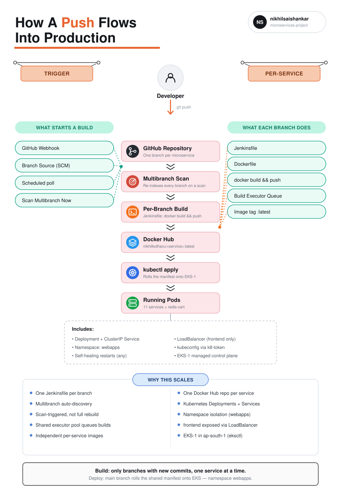
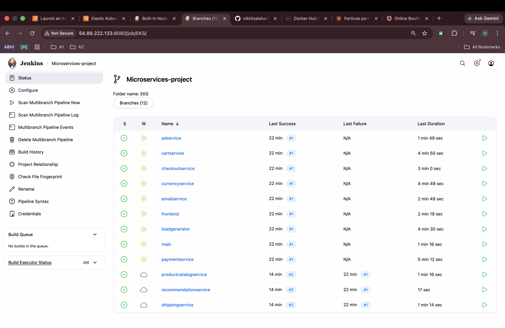
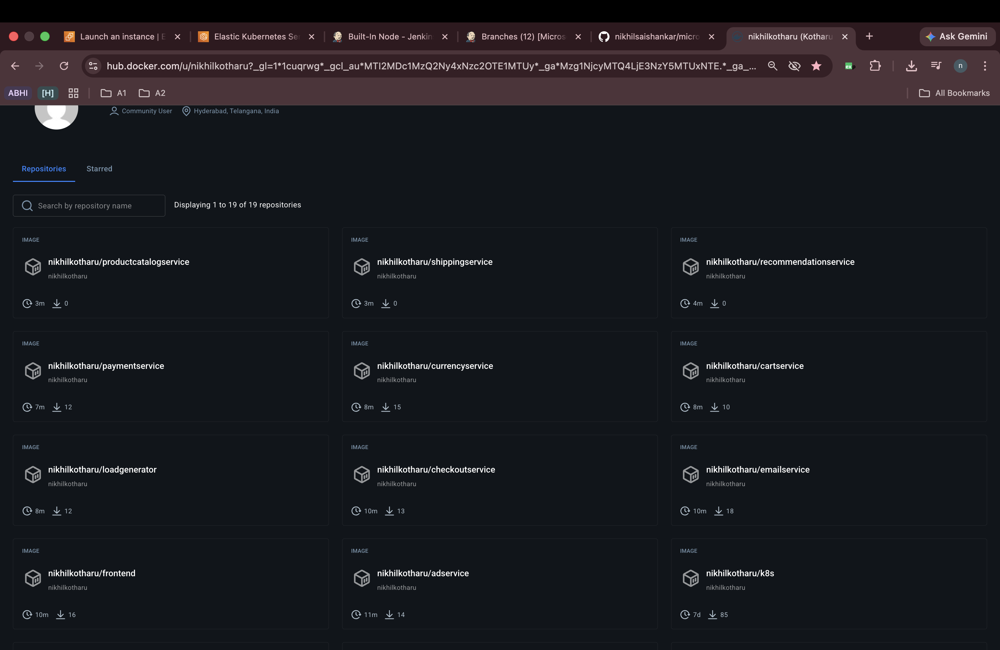
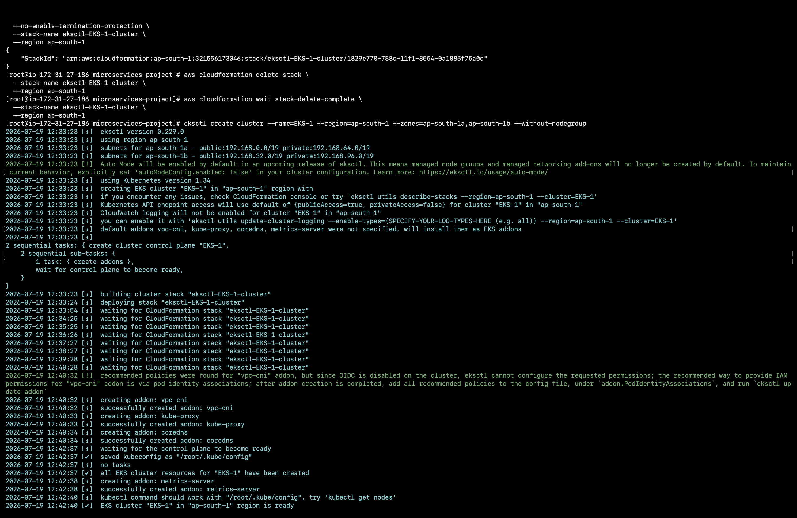
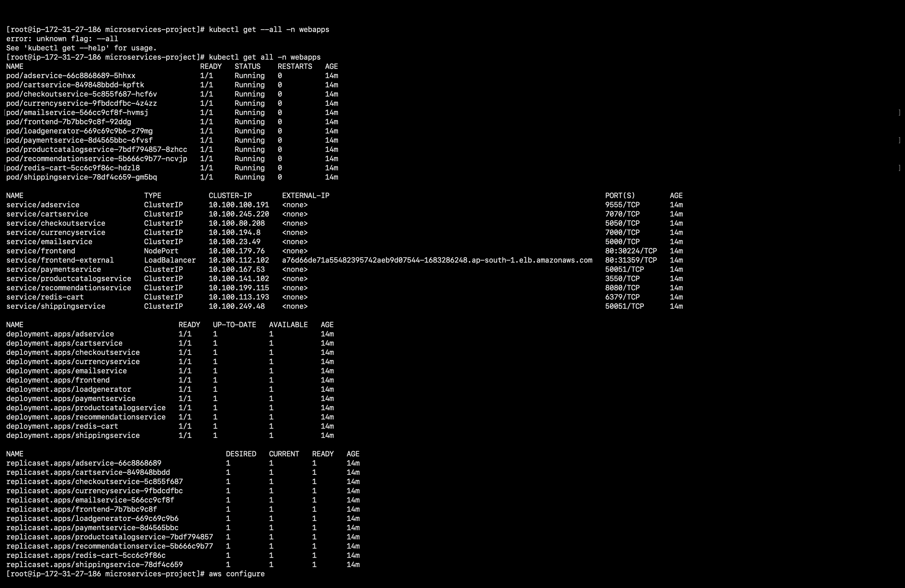
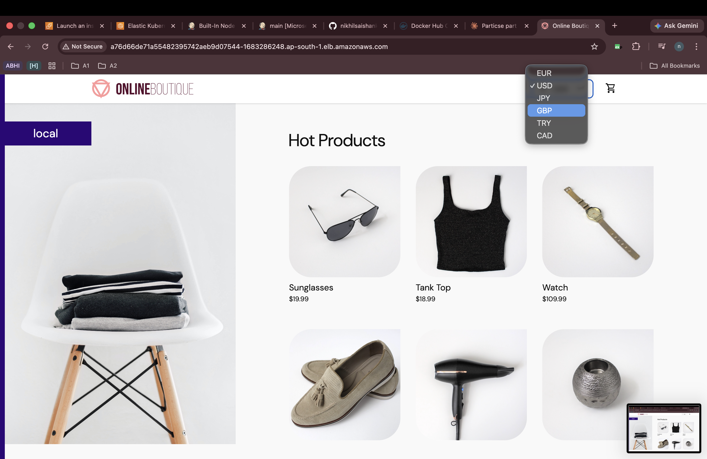
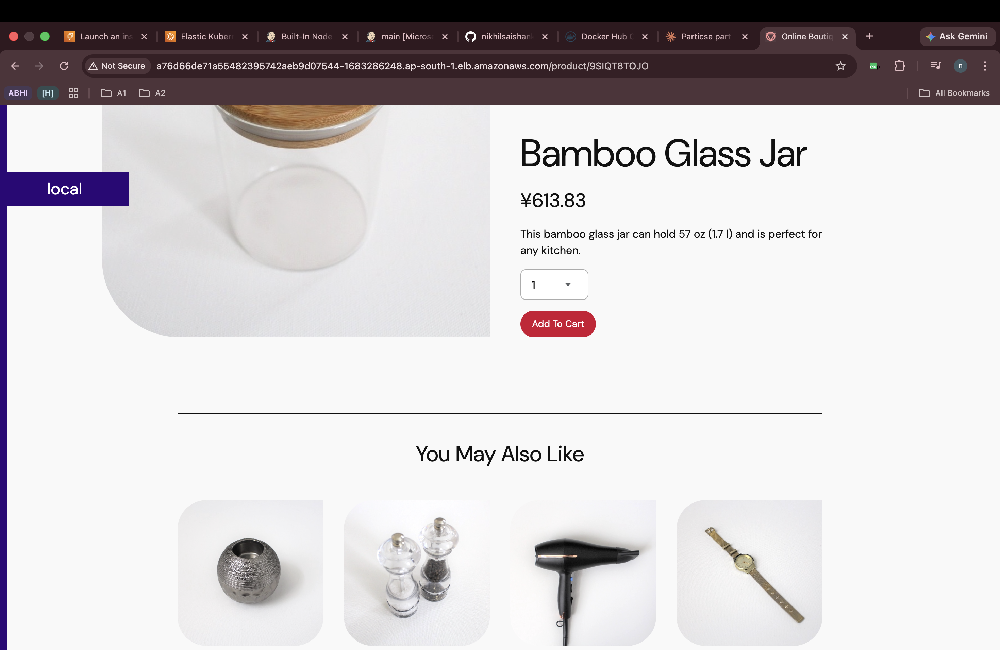
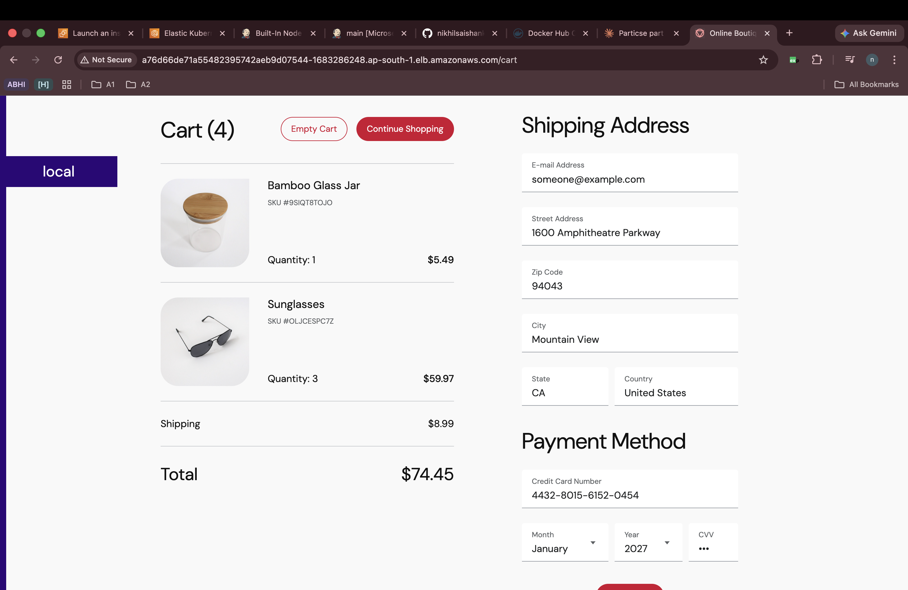

# microservices-project

A cloud-native microservices demo (**Online Boutique** — 10+ independent services
plus Redis) built with polyglot services, containerized with Docker, and deployed
onto an **AWS EKS** cluster with **Kubernetes**.

---

## Advanced Deployment


This section documents the CI/CD pipeline used to build, scan, and deploy each
microservice independently. Unlike a single monolithic pipeline, this project uses a
**Jenkins Multibranch Pipeline**, where every microservice lives on its own Git
branch with its own `Jenkinsfile` — so Jenkins builds, tags, and pushes only the
service that actually changed, instead of rebuilding the entire application.

### Why Multibranch (and not one Jenkinsfile per repo)

With 11 independently deployable services in one repository, a single shared
pipeline would rebuild and re-push every image on every commit — slow, wasteful,
and it defeats the purpose of a microservices architecture. Instead:

- Each service (`adservice`, `cartservice`, `checkoutservice`, `currencyservice`,
  `emailservice`, `frontend`, `loadgenerator`, `paymentservice`,
  `productcatalogservice`, `recommendationservice`, `shippingservice`) lives on its
  **own branch**, with its own source, `Dockerfile`, and `Jenkinsfile`.
- The `main` branch holds only the Kubernetes manifest
  ([`deployment-service.yml`](./deployment-service.yml)) and the cluster-deploy
  `Jenkinsfile`.
- Jenkins is pointed at the repo **once**, as a Multibranch Pipeline. It discovers
  every branch automatically and creates one sub-job per branch — no manual job
  creation per service.

### Architecture Diagram



### Pipeline Overview

```
 ┌──────────────┐
 │   Developer  │  git push (to ONE service branch, e.g. cartservice)
 │   (GitHub)   │────────────────┐
 └──────────────┘                │
                                 ▼
 ┌───────────────────────────────────────────────────────────────────────┐
 │           JENKINS — Multibranch Pipeline job "Microservices-project"    │
 │                                                                         │
 │   "Scan Multibranch Pipeline Now" re-indexes the repo's branches:       │
 │   only branches with new commits are queued for a build — every        │
 │   other service's sub-job is left untouched (no full rebuild).          │
 │                                                                         │
 │   adservice  cartservice  checkoutservice  currencyservice  emailservice│
 │   frontend   loadgenerator  main  paymentservice  productcatalogservice │
 │   recommendationservice  shippingservice                                │
 │        │            │              │                                   │
 │        ▼            ▼              ▼                                   │
 │   each branch runs ITS OWN Jenkinsfile:                                 │
 │     1. docker build  -t nikhilkotharu/<service>:latest .                │
 │     2. docker push       nikhilkotharu/<service>:latest                 │
 │                                                                         │
 │   Builds queue on the shared executor pool and run one after another    │
 │   (or in parallel, up to the number of free executors) — never blocking │
 │   unrelated services.                                                   │
 └───────────────────────────────────────────┬───────────────────────────┘
                                             │ docker push
                                             ▼
                                    ┌──────────────────┐
                                    │    Docker Hub     │  nikhilkotharu/<service>
                                    └────────┬─────────┘
                                             │ kubectl apply (main branch Jenkinsfile)
                                             ▼
 ┌───────────────────────────────────────────────────────────────────────┐
 │                    AWS EKS CLUSTER  (namespace: webapps)                 │
 │   adservice · cartservice · checkoutservice · currencyservice ·          │
 │   emailservice · frontend · paymentservice · productcatalogservice ·    │
 │   recommendationservice · shippingservice · redis-cart                  │
 └───────────────────────────────────────────────────────────────────────┘
```

### Step 1 — Create the Multibranch Pipeline job

On the Jenkins portal this is a one-time setup per repo — **not** per service:

1. *New Item* → select **Multibranch Pipeline** → name it (e.g.
   `Microservices-project`).
2. Under **Branch Sources**, add the Git source and point it at the repo:
   `https://github.com/nikhilsaishankar/microservices-project.git`, with the
   GitHub credentials configured under *Manage Jenkins → Credentials*.
3. Jenkins scans the repository, finds a `Jenkinsfile` on every branch, and
   automatically creates one sub-job per branch — no per-service job setup.
4. Enable periodic/webhook-triggered scanning so new branches and new commits are
   picked up without manual intervention.

Once configured, Jenkins lists every discovered branch as its own row, each with
independent build history and status:



### Step 2 — Each service owns its `Jenkinsfile`

Every service branch carries a small, self-contained `Jenkinsfile` that only
builds and pushes **that** service's image. For example, `adservice`:

```groovy
pipeline {
    agent any

    stages {
        stage('Build & Tag Docker Image') {
            steps {
                script {
                    withDockerRegistry(credentialsId: 'docker-cred', toolName: 'docker') {
                        sh "docker build -t nikhilkotharu/adservice:latest ."
                    }
                }
            }
        }

        stage('Push Docker Image') {
            steps {
                script {
                    withDockerRegistry(credentialsId: 'docker-cred', toolName: 'docker') {
                        sh "docker push nikhilkotharu/adservice:latest"
                    }
                }
            }
        }
    }
}
```

Every other service branch (`cartservice`, `checkoutservice`, `frontend`, …)
follows the exact same two-stage shape — only the image name (and, for services
like `cartservice` whose source lives under `src/`, the build `dir`) changes.
Because the logic lives on the branch itself, adding a new microservice is just
adding a new branch with its own `Jenkinsfile` — the Multibranch job picks it up
automatically on the next scan.

### Step 3 — Scan-driven, incremental builds

This is the core of "build only what changed":

- **Scan Multibranch Pipeline Now** re-indexes all branches against the remote.
  It compares each branch's HEAD to what Jenkins last built.
- Only the branch(es) with new commits are enqueued for a build — pushing to
  `paymentservice` does **not** trigger `frontend` or any other service's job.
- Queued builds run against the shared Jenkins **executor pool**. If multiple
  service branches change close together, their builds queue up and run one
  after another (or concurrently, bounded by however many executors are free) —
  visible under *Build Queue* / *Build Executor Status* on the Jenkins
  dashboard.
- **Scan Multibranch Pipeline Log** and **Multibranch Pipeline Events** give the
  audit trail of what was scanned and why a branch was (or wasn't) queued.

| Sidebar action | What it does |
|---|---|
| `Scan Multibranch Pipeline Now` | Re-index branches, queue builds only for changed ones |
| `Scan Multibranch Pipeline Log` | Log of the last scan — which branches were checked |
| `Multibranch Pipeline Events` | Webhook/event history that can trigger a scan |
| `Build Queue` / `Build Executor Status` | Live view of what's queued vs. currently running |

### Step 4 — Push to Docker Hub

Each service branch's pipeline pushes its own image to its own Docker Hub
repository, so images stay independently versioned and independently deployable:



### Step 5 — Deploy to Kubernetes (EKS)

The `main` branch's `Jenkinsfile` is deliberately separate from the service
branches — it doesn't build any image, it only rolls the current manifest out to
the cluster:

```groovy
pipeline {
    agent any

    stages {
        stage('Deploy To Kubernetes') {
            steps {
                withKubeCredentials(kubectlCredentials: [[
                    credentialsId: 'k8-token',
                    clusterName: 'EKS-1',
                    namespace: 'webapps',
                    serverUrl: '<eks-cluster-endpoint>'
                ]]) {
                    sh "kubectl apply -f deployment-service.yml"
                }
            }
        }

        stage('verify Deployment') {
            steps {
                withKubeCredentials(kubectlCredentials: [[
                    credentialsId: 'k8-token',
                    clusterName: 'EKS-1',
                    namespace: 'webapps',
                    serverUrl: '<eks-cluster-endpoint>'
                ]]) {
                    sh "kubectl get svc -n webapps"
                }
            }
        }
    }
}
```

The underlying EKS cluster (`EKS-1`, `ap-south-1`) is provisioned with `eksctl`:

```bash
eksctl create cluster --name=EKS-1 --region=ap-south-1 \
  --zones=ap-south-1a,ap-south-1b --without-nodegroup
```



Once `deployment-service.yml` is applied, every microservice comes up as its own
`Deployment` + `ClusterIP` service inside the `webapps` namespace, with `frontend`
fronted by a `LoadBalancer` service for external access:



### Verifying the deployment end to end

With every service pulled from its Docker Hub image and running in the cluster,
the storefront is reachable through the `frontend-external` LoadBalancer:


Cross-service calls confirm the full mesh is wired correctly — currency
conversion (`currencyservice`) on the product listing:



Product-detail recommendations (`recommendationservice`) alongside cart and
checkout (`cartservice`, `checkoutservice`, `paymentservice`, `shippingservice`,
`emailservice`):





#### Tooling Summary

| Component | Tool | Purpose |
|---|---|---|
| Source | Git branches (one per service) | Independent, isolated service pipelines |
| CI | Jenkins Multibranch Pipeline | Auto-discovers branches, builds only what changed |
| Build | `docker build` (per-service `Jenkinsfile`) | Produce a scoped, versioned image |
| Registry | Docker Hub | One repository per microservice |
| Deploy | `kubectl apply` (main branch `Jenkinsfile`) | Roll manifests out to the cluster |
| Orchestration | Kubernetes on AWS EKS | Run, scale, and self-heal all services |
